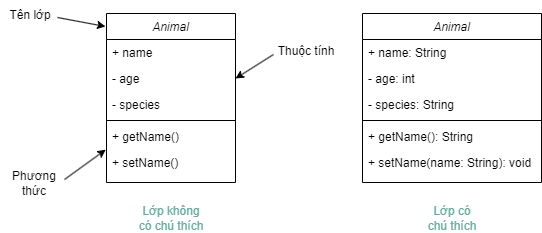
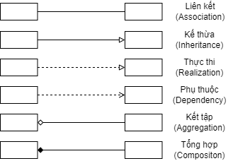
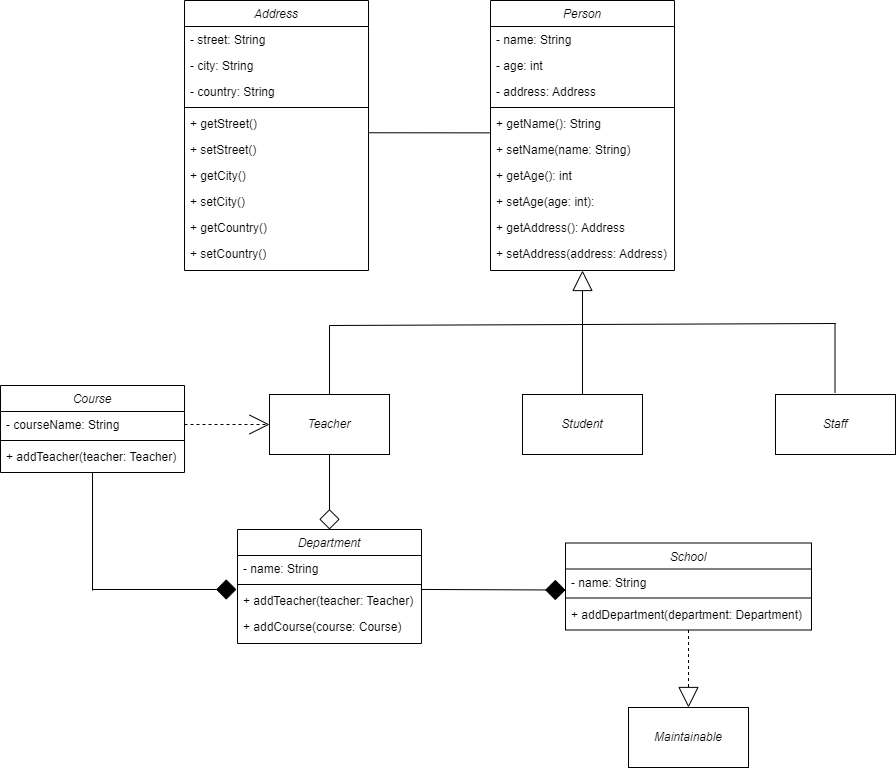

# Lập trình hướng đối tượng với Java


<p align = "center">


</p>

<p align = "center">
<a href="https://git.io/typing-svg"></a>
</p>

Chào mừng bạn đến với kho lưu trữ **Lập trình hướng đối tượng với Java**! Nơi đây cung cấp một nguồn tài nguyên toàn diện để khám phá và học hỏi lập trình hướng đối tượng qua ngôn ngữ Java.

> Lập trình hướng đối tượng (OOP - Object-Oriented Programming) là một mô hình lập trình phổ biến được sử dụng rộng rãi trong phát triển phần mềm. Nó được dựa trên các khái niệm về "đối tượng", là các thực thể kết hợp cả dữ liệu (thuộc tính) và các phương thức (hành vi). OOP tập trung vào việc thiết kế phần mềm dựa trên các đối tượng tương tác với nhau, thay vì quy trình và logic như trong lập trình hướng thủ tục.

<details>

<summary> Các nguyên tắc cơ bản của lập trình hướng đối tượng</summary>
<br/>

Lập trình hướng đối tượng dựa trên 4 nguyên tắc cơ bản, đó là: Đóng gói, Kế thừa, Đa hình, và Trừu tượng hóa. Mỗi nguyên tắc này cung cấp một cách tiếp cận để giải quyết các vấn đề trong phát triển phần mềm và giúp quản lý mã nguồn một cách hiệu quả hơn.

**1. Đóng gói** (Encapsulation): Đây là khái niệm che giấu chi tiết triển khai bên trong của đối tượng, ngăn người dùng trực tiếp truy cập vào dữ liệu bên trong. Đóng gói giúp bảo vệ dữ liệu và hành vi của đối tượng khỏi sự can thiệp không mong muốn và cung cấp một giao diện thống nhất để tương tác với đối tượng.

<details>

<summary>Đoạn mã minh họa</summary>

```java
// Lớp Employee (Nhân viên) chứa các thuộc tính: tên, tuổi, lương
public class Employee {
    // Các biến dữ liệu riêng tư để ngăn chặn truy cập trực tiếp từ bên ngoài lớp
    private String name;
    private int age;
    private double salary;

    // Constructor (hàm tạo) để khởi tạo các giá trị của đối tượng
    public Employee(String name, int age, double salary) {
        this.name = name;
        this.age = age;
        this.salary = salary;
    }

    // Các phương thức getter để truy cập các biến dữ liệu
    public String getName() {
        return name;
    }

    public int getAge() {
        return age;
    }

    public double getSalary() {
        return salary;
    }

    // Các phương thức setter để cập nhật giá trị của các biến dữ liệu
    public void setName(String name) {
        this.name = name;
    }

    public void setAge(int age) {
        this.age = age;
    }

    public void setSalary(double salary) {
        this.salary = salary;
    }
}

// Lớp Main để thực thi mã
public class Main {
    public static void main(String[] args) {
        // Tạo đối tượng của lớp Employee
        Employee emp = new Employee("John Doe", 30, 50000);

        // Truy cập và cập nhật thông qua các phương thức getter và setter
        System.out.println("Employee name: " + emp.getName());
        emp.setSalary(55000);
        System.out.println("Updated salary: " + emp.getSalary());
    }
}
```

Trong ví dụ này, các biến `name`, `age`, và `salary` được đánh dấu là `private`, điều này có nghĩa là chúng không thể được truy cập trực tiếp từ bên ngoài lớp `Employee`. Thay vào đó, các phương thức `getName()`, `getAge()`, `getSalary()`, `setName()`, `setAge()`, và `setSalary()` được cung cấp để truy cập và cập nhật giá trị của các biến này, đảm bảo tính đóng gói.

</details>

**2. Kế thừa** (Inheritance): Kế thừa cho phép một lớp mới kế thừa các thuộc tính và phương thức từ một lớp đã có sẵn. Lớp mới này có thể bổ sung thêm hoặc sửa đổi các thành phần thừa kế để đáp ứng nhu cầu riêng của nó, giúp tái sử dụng và mở rộng mã nguồn một cách hiệu quả.

<details>

<summary>Đoạn mã minh họa</summary>

```java
// Lớp cơ sở (hay lớp cha): Employee
public class Employee {
    private String name;
    private int age;

    // Constructor của lớp Employee
    public Employee(String name, int age) {
        this.name = name;
        this.age = age;
    }

    // Getter và Setter
    public String getName() {
        return name;
    }

    public void setName(String name) {
        this.name = name;
    }

    public int getAge() {
        return age;
    }

    public void setAge(int age) {
        this.age = age;
    }

    // Phương thức để hiển thị thông tin
    public void displayInfo() {
        System.out.println("Name: " + name + ", Age: " + age);
    }
}

// Lớp dẫn xuất (hay lớp con): Manager kế thừa từ Employee
public class Manager extends Employee {
    private double salary;

    // Constructor của lớp Manager
    public Manager(String name, int age, double salary) {
        super(name, age); // Gọi constructor của lớp cơ sở (lớp cha)
        this.salary = salary;
    }

    // Phương thức mới của lớp Manager
    @Override
    public void displayInfo() {
        // Gọi phương thức displayInfo của lớp cơ sở (lớp cha)
        super.displayInfo();
        System.out.println("Salary: " + salary);
    }
}

public class Main {
    public static void main(String[] args) {
        // Tạo đối tượng Manager
        Manager manager = new Manager("Alice Johnson", 42, 75000);
        manager.displayInfo(); // Hiển thị thông tin của Manager
    }
}
```

- Trong ví dụ này:
  - Lớp `Employee` là lớp cơ sở, chứa thông tin cơ bản như tên và tuổi.
  - Lớp `Manager` là lớp dẫn xuất từ `Employee` và bổ sung thêm thuộc tính `salary`.
  - Lớp `Manager` sử dụng từ khóa `extends` để kế thừa từ lớp `Employee`. Constructor của `Manager` gọi `super(name, age)`; để khởi tạo các thuộc tính được kế thừa từ lớp `Employee`.
  - Phương thức `displayInfo()` được ghi đè trong lớp `Manager` để thêm thông tin về mức lương, đồng thời gọi phương thức `displayInfo()` của lớp cơ sở để hiển thị thông tin cơ bản.

</details>

**3. Đa hình** (Polymorphism): Đa hình là khả năng mà theo đó các lớp khác nhau có thể được sử dụng thông qua cùng một giao diện. Phương thức có thể được định nghĩa trong một lớp cơ sở và được thay thế bởi các phương thức có cùng tên trong các lớp dẫn xuất, cho phép các đối tượng được xử lý thông qua giao diện chung mà không cần biết kiểu dữ liệu cụ thể của chúng.

Trong Java, tính đa hình được thể hiện thông qua việc ghi đè phương thức (method overriding) và nạp chồng phương thức (method overloading).

<details>

<summary>Ghi đè phương thức</summary>

```java
class Animal {
    void speak() {
        System.out.println("Animal speaks");
    }
}

// Lớp Dog (chó) kế thừa lớp Animal (động vật)
class Dog extends Animal {
    // Lớp Dog ghi đè phương thức speak() của lớp cha
    @Override
    void speak() {
        System.out.println("Dog barks");
    }
}

// Lớp Cat (mèo) kế thừa lớp Animal (động vật)
class Cat extends Animal {
    // Lớp Dog ghi đè phương thức speak() của lớp cha
    @Override
    void speak() {
        System.out.println("Cat meows");
    }
}

public class Main {
    public static void main(String[] args) {
        Animal myAnimal = new Animal();
        Animal myDog = new Dog();
        Animal myCat = new Cat();

        myAnimal.speak(); // Prints "Animal speaks"
        myDog.speak();    // Prints "Dog barks"
        myCat.speak();    // Prints "Cat meows"
    }
}
```

Trong ví dụ này, phương thức `speak()` được ghi đè trong các lớp `Dog` và `Cat`. Khi gọi phương thức `speak()` trên đối tượng của lớp con, Java xác định phương thức nào sẽ được gọi tại thời điểm chạy, tùy thuộc vào loại đối tượng mà biến tham chiếu đến.

</details>

<details>

<summary>Nạp chồng phương thức</summary>

```java
class Printer {
    // In chuỗi
    void print(String data) {
        System.out.println("String: " + data);
    }

    // In số nguyên
    void print(int data) {
        System.out.println("Integer: " + data);
    }

    // In số thực
    void print(double data) {
        System.out.println("Double: " + data);
    }
}

public class Main {
    public static void main(String[] args) {
        Printer printer = new Printer();

        // Gọi phương thức print nạp chồng
        printer.print("Hello, World!");
        printer.print(123);
        printer.print(98.76);
    }
}
```

- Trong ví dụ này:
  - Lớp `Printer` có ba phiên bản của phương thức `print`, mỗi phiên bản xử lý một kiểu dữ liệu cụ thể: `String`, `int`, và `double`.
  - Mỗi lần gọi phương thức `print`, Java sẽ xác định phiên bản phù hợp dựa trên kiểu dữ liệu của đối số truyền vào.

</details>

<details>

<summary>Triển khai giao diện</summary>

Tính đa hình cũng được thể hiện rất rõ ràng qua cơ chế sử dụng interface. Interface trong Java là một cách để đạt được đa hình ở mức độ cao hơn, cho phép một lớp triển khai (implement) nhiều interface và một interface có thể được triển khai bởi nhiều lớp khác nhau.

Giả sử chúng ta có một interface `CanFly` và hai lớp `Bird` và `Airplane` cả hai đều triển khai interface này:

```java
interface CanFly {
    void fly();
}

class Bird implements CanFly {
    public void fly() {
        System.out.println("The bird flaps its wings to fly.");
    }
}

class Airplane implements CanFly {
    public void fly() {
        System.out.println("The airplane turns on its engines to fly.");
    }
}

public class TestPolymorphism {
    public static void main(String[] args) {
        CanFly myBird = new Bird();
        CanFly myAirplane = new Airplane();

        myBird.fly();        // Output: The bird flaps its wings to fly.
        myAirplane.fly();    // Output: The airplane turns on its engines to fly.
    }
}
```

- Trong ví dụ này:
  - Interface `CanFly` định nghĩa phương thức `fly()` mà không cung cấp phần thân phương thức.
  - Cả `Bird` và `Airplane` đều triển khai phương thức `fly()` theo cách riêng của chúng.
  - Cả hai đối tượng `myBird` và `myAirplane` đều được tham chiếu thông qua kiểu interface `CanFly`, và khi gọi phương thức `fly()`, đa hình cho phép chúng ta không cần quan tâm đến việc đối tượng thuộc lớp nào; chúng ta chỉ biết rằng chúng có thể bay.

</details>

**4. Trừu tượng hóa** (Abstraction): Trừu tượng hóa cho phép lập trình viên tập trung vào những gì một đối tượng làm mà không cần quan tâm đến cách thực hiện. Nó tạo ra một lớp cơ sở mô tả một giao diện tổng quát mà các lớp dẫn xuất sẽ thực thi, đơn giản hóa việc quản lý sự phức tạp của hệ thống.

Trong Java, trừu tượng hóa có thể được thực hiện bằng hai cách:

<details>

<summary>Lớp trừu tượng</summary>

Lớp trừu tượng (Abstract Class) là một lớp không thể tạo đối tượng và có thể chứa phương thức trừu tượng không có phần thân.

```java
abstract class Animal {
    // Phương thức trừu tượng
    abstract void makeSound();

    // Phương thức bình thường
    void breathe() {
        System.out.println("Breathing...");
    }
}

class Dog extends Animal {
    // Triển khai phương thức trừu tượng trong lớp con
    void makeSound() {
        System.out.println("Bark");
    }
}

public class Main {
    public static void main(String[] args) {
        Animal myDog = new Dog();
        myDog.makeSound(); // In ra "Bark"
        myDog.breathe();   // In ra "Breathing..."
    }
}
```

- Trong ví dụ này:
  - `Animal` là một lớp trừu tượng có phương thức trừu tượng `makeSound()`.
  - `Dog` là lớp kế thừa từ `Animal` và phải cung cấp triển khai cụ thể cho phương thức trừu tượng `makeSound()`.

</details>

<details>

<summary>Giao diện</summary>

Giao diện (Interface) chỉ có thể chứa các phương thức trừu tượng mà không có triển khai.

```java
interface Vehicle {
    void start();
    void stop();
}

class Car implements Vehicle {
    public void start() {
        System.out.println("Car starting");
    }

    public void stop() {
        System.out.println("Car stopping");
    }
}

class Bike implements Vehicle {
    public void start() {
        System.out.println("Bike starting");
    }

    public void stop() {
        System.out.println("Bike stopping");
    }
}

public class Main {
    public static void main(String[] args) {
        Vehicle myCar = new Car();
        Vehicle myBike = new Bike();
        
        myCar.start();  // In ra "Car starting"
        myCar.stop();   // In ra "Car stopping"
        myBike.start(); // In ra "Bike starting"
        myBike.stop();  // In ra "Bike stopping"
    }
}
```

Ở đây, `Vehicle` là một interface định nghĩa hai phương thức trừu tượng: `start()` và `stop()`. Các lớp `Car` và `Bike` triển khai interface này và cung cấp triển khai cụ thể cho mỗi phương thức.

</details>

</details>

<details>

<summary>Ưu điểm của lập trình hướng đối tượng</summary>
<br/>

Lập trình hướng đối tượng mang lại nhiều ưu điểm vượt trội trong phát triển phần mềm, giúp nó trở thành một trong những mô hình thiết kế và lập trình chính trong ngành công nghệ thông tin. Dưới đây là những ưu điểm của nó:

- **Tái sử dụng mã**: OOP cho phép lập trình viên sử dụng lại mã nguồn thông qua cơ chế kế thừa. Lớp con có thể kế thừa tính năng từ lớp cha mà không cần phải viết lại mã đó. Điều này giúp giảm bớt lượng công việc lập trình, giảm thiểu các lỗi tiềm ẩn và tăng tốc độ phát triển phần mềm.

- **Dễ dàng bảo trì và sửa lỗi**: Cấu trúc đóng gói trong OOP giúp che giấu chi tiết triển khai, chỉ cung cấp giao diện (interface) cần thiết cho người dùng. Điều này làm cho việc bảo trì và cập nhật hệ thống trở nên dễ dàng hơn, vì thay đổi bên trong một đối tượng không ảnh hưởng tới các đối tượng khác.

- **Mô hình hóa thực tiễn**: OOP cho phép lập trình viên mô hình hóa các thực thể thực tế dưới dạng đối tượng phần mềm, làm cho mã nguồn dễ hiểu và quản lý hơn. Việc sử dụng các đối tượng như là biểu diễn của dữ liệu và hành vi trong thế giới thực giúp phát triển phần mềm trở nên trực quan và gần gũi hơn với người lập trình.

- **Tính mở rộng**: Nhờ vào khả năng kế thừa và đóng gói, OOP dễ dàng mở rộng. Một lớp mới có thể được tạo ra với sự kế thừa từ một hoặc nhiều lớp đã tồn tại mà không làm ảnh hưởng tới những lớp đó. Điều này giúp hệ thống phát triển một cách linh hoạt và thích ứng với nhu cầu mới một cách nhanh chóng.

- **Tính bảo mật**: Đóng gói không chỉ giúp ẩn đi chi tiết triển khai mà còn cung cấp một lớp bảo mật. Dữ liệu bên trong một đối tượng được bảo vệ khỏi sự truy cập trực tiếp từ bên ngoài, đảm bảo tính toàn vẹn và an toàn của dữ liệu.

</details>

<details>

<summary>Lý do bắt đầu học lập trình hướng đối tượng bằng Java</summary>
<br/>

Java là một trong những ngôn ngữ lập trình phổ biến nhất được sử dụng để giảng dạy lập trình hướng đối tượng vì nhiều lý do chính đáng.

- **Java là một ngôn ngữ thuần túy hướng đối tượng**, nghĩa là mọi thứ trong Java đều là đối tượng hoặc lớp. Các khái niệm như kế thừa, đóng gói, đa hình, và trừu tượng hoàn toàn được tích hợp sẵn trong ngôn ngữ. Điều này giúp người học dễ dàng tiếp cận và thực hành các nguyên lý OOP một cách tự nhiên trong quá trình lập trình.

- **Java có cú pháp khá rõ ràng và dễ hiểu.** Cú pháp của Java dựa trên C/C++, nhưng đã loại bỏ một số tính năng phức tạp như con trỏ trực tiếp, làm cho nó trở thành ngôn ngữ lý tưởng để giảng dạy cho người mới bắt đầu. Việc loại bỏ những tính năng phức tạp này giúp người học tập trung vào việc hiểu các khái niệm cốt lõi của OOP mà không bị sa lầy vào các chi tiết khó hiểu.

- **Java là ngôn ngữ độc lập nền tảng**, có thể chạy trên bất kỳ hệ điều hành nào có máy ảo Java (JVM). Điều này có nghĩa là các chương trình Java có thể phát triển và thực thi một cách nhất quán trên các nền tảng khác nhau mà không cần thay đổi mã. Sự linh hoạt này là lý tưởng cho môi trường học tập, nơi sinh viên và giáo viên có thể sử dụng nhiều loại phần cứng và phần mềm.

</details>

## Mục lục

Trong khi sử dụng kho lưu trữ này cho việc học tập, bạn nên tuân theo nguyên tắc sắp xếp được đề cập sau đây. Hãy đọc các mục theo đúng quy tắc từ trên xuống dưới, những phần đầu tiên sẽ là cơ sở của những nội dung tiếp theo. Riêng phần *Phụ lục* bạn có thể tham khảo bất cứ lúc nào, nó chứa một số cuốn sách tôi sử dụng cho việc thiết kế nên kho lưu trữ này.

> Để đồng bộ và dễ kiểm soát, lớp chứa phương thức main để thực thi mã được đặt tên giống như nội dung bài học. Các lớp khác trong bài học để minh họa. Chẳng hạn, bài học về Interface nằm trong `Interface.java` có các lớp: `Movable`, `Trackable`, `Drone`, `Interface` thì các lớp `Movable`, `Trackable`, `Drone` có tác dụng diễn giải cho kiến thức bài học, còn lớp `Interface` để thực thi mã từ các lớp trước nó.

<details>
<summary>Phần 1: Giới thiệu</summary>

- [**Bắt đầu với Java**](#bắt-đầu-với-java)
  - Máy ảo Java
  - So sánh Java với một số ngôn ngữ lập trình khác: tính di động, tốc độ và an toàn
  - Quản lý động bộ nhớ
  - Khả năng phát hiện và xử lý lỗi
- [**Naming Convention**](#quy-ước-định-danh)
- [**Unified Modeling Language**](#ngôn-ngữ-mô-hình-hóa-thống-nhất)
- [**The Java Language**](1.%20The%20Java%20Language/)
  - [HelloWorld](1.%20The%20Java%20Language/HelloWorld.java)
  - [HelloJava](1.%20The%20Java%20Language/HelloJava.java)
  - [DataTypes](1.%20The%20Java%20Language/DataTypes.java)
  - [Wrappers](1.%20The%20Java%20Language/Wrappers.java)
  - [Boxing](1.%20The%20Java%20Language/Boxing.java)
  - [Enumerations](1.%20The%20Java%20Language/Enumerations.java)
  - [Arrays](1.%20The%20Java%20Language/Arrays.java)
  - [ArgumentPassing](1.%20The%20Java%20Language/ArgumentPassing.java)
  - [MethodOverloading](1.%20The%20Java%20Language/MethodOverloading.java)
  - [ObjectsInJava](1.%20The%20Java%20Language/ObjectsInJava.java)
  - [InitializerBlock](1.%20The%20Java%20Language/InitializerBlock.java)
  - [ObjectCreation](1.%20The%20Java%20Language/ObjectCreation.java)
  - [ObjectDestruction](1.%20The%20Java%20Language/ObjectDestruction.java)
  - [ThisReference](1.%20The%20Java%20Language/ThisReference.java)

</details>

<details>

<summary>Phần 2: Làm việc với đối tượng và lớp trong Java</summary>

- [**Classes in Java**](2.%20Classes%20in%20Java/)
  - [Subclass](2.%20Classes%20in%20Java/Subclass.java)
  - [Casting](2.%20Classes%20in%20Java/Casting.java)
  - [SuperConstructor](2.%20Classes%20in%20Java/SuperConstructor.java)
  - [Abstract](2.%20Classes%20in%20Java/Abstract.java)
  - [Interface](2.%20Classes%20in%20Java/Interface.java)
  - [Callback](2.%20Classes%20in%20Java/Callback.java)
  - [InterfaceVariables](2.%20Classes%20in%20Java/InterfaceVariables.java)
  - [SubInterface](2.%20Classes%20in%20Java/SubInterface.java)
- **Inner Classes**
  - [NestedClass](2.%20Classes%20in%20Java/NestedClass.java)
  - [InnerClass](2.%20Classes%20in%20Java/InnerClass.java)
  - [AdapterClass](2.%20Classes%20in%20Java/AdapterClass.java)
  - [WithinMethods](2.%20Classes%20in%20Java/WithinMethods.java)
  - [StaticInnerClass](2.%20Classes%20in%20Java/StaticInnerClass.java)
  - [AnonymousInnerClass](2.%20Classes%20in%20Java/AnonymousInnerClass.java)
  - [EventHandling](2.%20Classes%20in%20Java/EventHandling.java)
- **The Object Class**
  - [TheObjectClass](2.%20Classes%20in%20Java/TheObjectClass.java)
  - [Equals](2.%20Classes%20in%20Java/Equals.java)
  - [Hashcode](2.%20Classes%20in%20Java/Hashcode.java)
  - [Clone](2.%20Classes%20in%20Java/Clone.java)
- **The Class Class**
  - [TheClassClass](2.%20Classes%20in%20Java/TheClassClass.java)
  - [Reflection](2.%20Classes%20in%20Java/Reflection.java)
- **Annotations**
  - [Annotations](2.%20Classes%20in%20Java/Annotations.java)
- **Generics**

</details>

<details>

<summary>Phần 3: Công cụ cơ bản và thiết yếu của Java</summary>

- [**Core Ultilities**](3.%20Core%20Ultilities/)
  - [StringTips](3.%20Core%20Ultilities/StringTips.java)
  - [Math](3.%20Core%20Ultilities/Math.java)
  - [Random](3.%20Core%20Ultilities/Random.java)
  - [Time](3.%20Core%20Ultilities/Time.java)
  - [Collections](3.%20Core%20Ultilities/Collections.java)
  - [Iteration](3.%20Core%20Ultilities/Iteration.java)
  - [Properties](3.%20Core%20Ultilities/Properties.java)
  - [LoggingAPI](3.%20Core%20Ultilities/LoggingAPI.java)

</details>

<details>

<summary>Phần 4: Tiện ích vào - ra với Java</summary>

- [**IO Facilities**](4.%20IO%20Facilities/)
  - Streams
  - Pipes
  - Files
  - DataCompression
  - Buffers

</details>

<details>

<summary>Phần 5: Cấu trúc dữ liệu và Thuật toán bằng Java</summary>

> Mục này gần như cùng thứ tự với kho lưu trữ của tôi: [**Cấu trúc dữ liệu và Thuật toán sử dụng C/C++**](https://github.com/HaiAu2501/Data-Structures-and-Algorithms-using-C), chỉ khác là được viết bằng ngôn ngữ Java. Sẽ có một số khác biệt giữa hai ngôn ngữ, bạn đọc có thể tự đối chiếu chúng.

- **Tuần 1: Làm quen với Java**
  - [SumTwoInts](5.%20Data%20Structures%20and%20Algorithms/SumTwoInts.java)
  - [SumOfArray](5.%20Data%20Structures%20and%20Algorithms/SumOfArray.java)
  - [MaxSubarray](5.%20Data%20Structures%20and%20Algorithms/MaxSubarray.java)
- **Tuần 2: Thuật toán Đệ quy & Thuật toán Quay lui**
- **Tuần 3: Thuật toán Nhánh cận & Thuật toán Tham lam**
- **Tuần 4: Thuật toán Quy hoạch động**
- **Tuần 5: Ngăn xếp & Hàng đợi**

</details>

<details>

<summary>Phần 6: Lập trình mạng sử dụng Java</summary>

</details>

<details>

<summary>Phụ lục</summary>

- [**Chỉ định truy cập**](#chỉ-định-truy-cập)
- [**Tài liệu tham khảo**](#tài-liệu-tham-khảo)
- [**Tải xuống tài liệu tham khảo**](documents)
- [**Dự án của tôi**](.projects)
  - [**TicTacToe**](.projects/TicTacToe.java)

</details>

## Bắt đầu với Java

<details>

<summary>1. Máy ảo Java (JVM)</summary>
<br/>

Java vừa là ngôn ngữ lập trình vừa được **biên dịch** (complied) vừa được **thông dịch** (interpreted). Trong Java, mã nguồn được biên dịch thành bytecode, đó là các chỉ thị nhị phân đơn giản hoạt động như mã máy cho máy tính. Tuy nhiên, khác với C hay C++, bytecode của Java không phải là mã máy bản địa cho bất kỳ loại vi xử lý cụ thể nào mà là cho một máy ảo Java (JVM), một nền tảng chung cho mọi hệ thống.

Bytecode này sau đó được máy ảo Java thông dịch và thực thi như thể nó là mã máy bản địa. JVM hoạt động giống như một hệ điều hành thực sự trong việc quản lý bộ nhớ và xử lý các lệnh, đảm bảo an toàn và di động của mã. Mọi đặc điểm của ngôn ngữ Java đều được định nghĩa rõ ràng, không phụ thuộc vào hệ thống nền tảng cụ thể nào, giúp Java có khả năng chạy đồng nhất trên nhiều nền tảng khác nhau mà không cần chỉnh sửa mã.

JVM cung cấp một môi trường thực thi an toàn, nơi nó thực hiện các chức năng tương tự như một hệ điều hành. Nó quản lý bộ nhớ, thực thi các lệnh dựa trên ngăn xếp, và xử lý các kiểu dữ liệu nguyên thủy. Việc này giảm thiểu các rủi ro bảo mật và tăng tính ổn định của ứng dụng.

</details>

<details>

<summary>2. So sánh Java với một số ngôn ngữ lập trình khác: tính di động, tốc độ và an toàn</summary>
<br/>

Dù có vẻ ngoài tương tự như C và C++ về cú pháp, Java không phải là hậu duệ trực tiếp của C hay là phiên bản tiếp theo của C++. Java có nhiều điểm chung với các ngôn ngữ động như Smalltalk và Lisp hơn là với C. Sự giống nhau chỉ dừng lại ở cú pháp bên ngoài như sử dụng nhiều dấu ngoặc nhọn và dấu chấm phẩy. Java thừa hưởng triết lý của C về một ngôn ngữ tốt nên gọn nhẹ, dễ nhớ nhưng lại mở rộng vốn từ vựng qua các gói lớp Java.

Ngôn ngữ kịch bản như Perl, Python và Ruby rất phổ biến vì chúng phù hợp cho các ứng dụng an toàn, được kết nối mạng. Tuy nhiên, hầu hết các ngôn ngữ kịch bản không được thiết kế cho lập trình quy mô lớn nghiêm túc. Chúng thường không phù hợp cho các dự án lớn hay phức tạp vì cấu trúc chương trình lỏng lẻo và hệ thống kiểu dữ liệu đơn giản.

Java cung cấp một nền tảng an toàn để phát triển các framework cấp cao hơn và thậm chí là các ngôn ngữ khác, kết hợp sự đơn giản và tính năng của Java cho phép phát triển nhanh chóng và dễ dàng thay đổi ứng dụng. Java cũng đã học hỏi từ các tính năng của Smalltalk và cải tiến chúng, đặc biệt là trong việc sử dụng bộ kiểm tra bytecode để đảm bảo tính chính xác của mã Java biên dịch, giúp nâng cao hiệu suất và đảm bảo an toàn hơn so với Smalltalk.

Java được thiết kế để là một ngôn ngữ an toàn, không chỉ chống lại các lỗi phần mềm mà còn các vấn đề thường gặp trong thiết kế và lập trình. Java cung cấp nhiều lớp bảo vệ, từ kiểm tra an toàn của mã trước khi chạy cho đến cách thức mà trình tải lớp (class loader), một cơ chế tải bytecode của trình thông dịch Java, tạo ra một "bức tường" xung quanh các lớp không đáng tin cậy. Những tính năng này là nền tảng cho các chính sách bảo mật cấp cao, cho phép hoặc không cho phép các loại hoạt động khác nhau trên từng ứng dụng.

Java bắt đầu từ một "tấm bảng trắng" và do đó có thể tránh được những tính năng phức tạp hoặc gây tranh cãi có trong các ngôn ngữ khác. Ví dụ, Java không cho phép lập trình viên tái định nghĩa các toán tử (như + hay -), không có tiền xử lý mã nguồn như macros hay #define statements, những thứ thường được dùng trong các ngôn ngữ khác để hỗ trợ sự phụ thuộc vào nền tảng.

Java cũng cung cấp một cấu trúc gói (package) rõ ràng để tổ chức các tệp lớp, giúp trình biên dịch xử lý một số chức năng của công cụ make truyền thống một cách hiệu quả. Mọi thông tin kiểu dữ liệu đều được bảo toàn trong các lớp Java đã biên dịch, không cần tới các tệp tiêu đề nguồn thừa như trong C/C++. Điều này khiến mã Java dễ đọc và ít cần đến ngữ cảnh hơn.

Java chỉ hỗ trợ kế thừa đơn (mỗi lớp chỉ có một lớp "cha" duy nhất) nhưng cho phép kế thừa nhiều giao diện (interface). Giao diện trong Java, tương tự như lớp trừu tượng trong C++, xác định hành vi của một đối tượng mà không định nghĩa thực thi của nó. Đây là một cơ chế mạnh mẽ cho phép nhà phát triển định nghĩa một "hợp đồng" về hành vi của đối tượng mà có thể được sử dụng và tham chiếu một cách độc lập với bất kỳ thực thi đối tượng cụ thể nào.

</details>

<details>

<summary>3. Quản lý động bộ nhớ</summary>
<br/>

Java loại bỏ việc sử dụng con trỏ có thể tham chiếu tới bất kỳ khu vực bộ nhớ nào và thêm vào thu gom rác tự động cùng mảng cấp cao. Những tính năng này giúp loại bỏ nhiều vấn đề liên quan đến an toàn, khả năng chuyển đổi và tối ưu hóa mà các ngôn ngữ khác thường gặp phải. Trong Java, các đối tượng không còn được sử dụng sẽ tự động được thu hồi bộ nhớ, giảm thiểu lỗi do quản lý bộ nhớ thủ công.

Java không sử dụng con trỏ theo nghĩa truyền thống mà thay vào đó là các tham chiếu, định kiểu chặt chẽ và an toàn hơn. Các đối tượng trong Java, ngoại trừ các kiểu nguyên thủy, được truy cập qua tham chiếu. Điều này cho phép xây dựng các cấu trúc dữ liệu phức tạp một cách an toàn về kiểu dữ liệu mà không có rủi ro liên quan đến con trỏ trong C/C++.

</details>

<details>

<summary>4. Khả năng phát hiện và xử lý lỗi</summary>
<br/>

Java được thiết kế để xử lý lỗi một cách thông minh và hiệu quả, nhờ vào cơ chế quản lý ngoại lệ mạnh mẽ. Trong Java, các lỗi không chỉ được bắt và xử lý tại một nơi cụ thể trong chương trình thông qua khối mã "catch", mà còn được đóng gói thành các đối tượng ngoại lệ. Mỗi đối tượng này mang thông tin về nguyên nhân gây ra lỗi, giúp lập trình viên dễ dàng hiểu và xử lý lỗi một cách chính xác. Trình biên dịch Java đòi hỏi phương thức phải tuyên bố các ngoại lệ mà nó có thể phát sinh, hoặc là phải tự xử lý chúng ngay lập tức. Điều này giúp đưa thông tin lỗi lên cùng mức độ quan trọng với các thông tin khác như kiểu dữ liệu trả về hay tham số của phương thức. Qua đó, khi lập trình, bạn có thể dự đoán và chuẩn bị sẵn sàng cho các tình huống có thể xảy ra, đảm bảo rằng ứng dụng của bạn sẽ hoạt động ổn định và an toàn hơn.

</details>

## Quy ước định danh

Trong lập trình và phát triển phần mềm, **quy ước định danh** (naming convention) là một tập hợp các quy tắc cho việc chọn tên các biến, hàm, lớp, và các đối tượng khác trong mã nguồn. Quy ước định danh giúp làm cho mã nguồn dễ đọc, dễ hiểu và dễ bảo trì hơn. Kho lưu trữ của tôi tuân thủ nghiêm ngặt quy ước này, được đề cập dưới đây.

<details>

<summary>Quy ước định danh</summary>
<ol>

<li><b>Lớp (Class) và Giao diện (Interface):</b></li>

- *Lớp:* Tên lớp luôn bắt đầu bằng chữ cái in hoa (PascalCase). Nếu tên lớp bao gồm nhiều từ, mỗi từ cũng phải bắt đầu bằng chữ cái in hoa. Ví dụ: `Student`, `Car`, `ColorChooser`.

- *Giao diện:* Giống như class, tên interface cũng sử dụng PascalCase. Thường thì tên interface sẽ bắt đầu bằng các chữ cái viết hoa như `I` hoặc sử dụng các hậu tố/suffix như `able` hoặc `ible` để mô tả tính năng, chẳng hạn như `Runnable`, `Accessible`.

<li><b>Phương thức (Method)/Hàm (Function) và Biến (Variable):</b></li>

- Tên phương thức luôn bắt đầu bằng chữ thường và theo sau là camelCase. Tên phương thức thường là các động từ hoặc cụm động từ mô tả hành động mà phương thức đó thực hiện. Ví dụ: `getName()`, `calculateTotalWidth()`.

- Tên biến cũng nên bắt đầu bằng chữ thường và theo sau là camelCase. Tên biến nên rõ ràng và mô tả được giá trị mà chúng đại diện. Ví dụ: `height`, `numberOfStudents`.

<li><b>Gói (Package)</b></li>

- Tên gói nên được viết thường hoàn toàn để tránh xung đột với tên lớp và interface.

</ol>

Một ví dụ về lớp `Dog`:

```java
package com.example.animals;

/**
 * A generic Dog class that can be used as a base class for specific breeds.
 */
public class Dog {
    private String name;
    private int age;

    /**
     * Constructor for Dog class.
     *
     * @param name The name of the dog.
     * @param age The age of the dog.
     */
    public Dog(String name, int age) {
        this.name = name;
        this.age = age;
    }

    /**
     * Returns the name of the dog.
     *
     * @return The name of the dog.
     */
    public String getName() {
        return name;
    }

    /**
     * Sets the name of the dog.
     *
     * @param name New name for the dog.
     */
    public void setName(String name) {
        this.name = name;
    }

    /**
     * Returns the age of the dog.
     *
     * @return The age of the dog.
     */
    public int getAge() {
        return age;
    }

    /**
     * Sets the age of the dog.
     *
     * @param age New age for the dog.
     */
    public void setAge(int age) {
        this.age = age;
    }

    /**
     * Provides a string representation of the dog.
     *
     * @return A string describing the dog's details.
     */
    @Override
    public String toString() {
        return "Dog[name=" + name + ", age=" + age + "]";
    }
}
```

</details>

## Chỉ định truy cập

<div align="center">
<table class="tg">
<thead>
  <tr>
    <th class="tg-c3ow" colspan="2">Chỉ định truy cập</th>
    <th class="tg-c3ow">public</th>
    <th class="tg-c3ow">protected</th>
    <th class="tg-c3ow">default</th>
    <th class="tg-c3ow">private</th>
  </tr>
</thead>
<tbody>
  <tr>
    <td class="tg-lboi" rowspan="3">Cùng package<br></td>
    <td class="tg-0pky">Bên trong lớp</td>
    <td class="tg-c3ow">Có</td>
    <td class="tg-c3ow">Có</td>
    <td class="tg-c3ow">Có</td>
    <td class="tg-c3ow">Có</td>
  </tr>
  <tr>
    <td class="tg-0pky">Lớp con</td>
    <td class="tg-c3ow">Có</td>
    <td class="tg-c3ow">Có</td>
    <td class="tg-c3ow">Có</td>
    <td class="tg-7btt">Không</td>
  </tr>
  <tr>
    <td class="tg-0pky">Lớp khác</td>
    <td class="tg-c3ow">Có</td>
    <td class="tg-c3ow">Có</td>
    <td class="tg-c3ow">Có</td>
    <td class="tg-7btt">Không</td>
  </tr>
  <tr>
    <td class="tg-lboi" rowspan="2">Khác package</td>
    <td class="tg-0pky">Lớp con</td>
    <td class="tg-c3ow">Có</td>
    <td class="tg-c3ow">Có</td>
    <td class="tg-7btt">Không</td>
    <td class="tg-7btt">Không</td>
  </tr>
  <tr>
    <td class="tg-0pky">Lớp khác</td>
    <td class="tg-c3ow">Có</td>
    <td class="tg-7btt">Không</td>
    <td class="tg-7btt">Không</td>
    <td class="tg-7btt">Không</td>
  </tr>
</tbody>
</table>
</div>

## Ngôn ngữ mô hình hóa thống nhất

Unified Modeling Language (UML) là một công cụ mô hình hóa đồ họa tiêu chuẩn, được thiết kế để phác họa, mô tả và tài liệu về các khía cạnh khác nhau của phần mềm ứng dụng. Nó đặc biệt hữu ích trong lĩnh vực lập trình hướng đối tượng, vì nó cung cấp một cách thức trực quan để thể hiện các lớp, đối tượng, và các mối quan hệ giữa chúng. UML bao gồm nhiều loại sơ đồ khác nhau, nhưng trong bối cảnh lập trình hướng đối tượng, sơ đồ lớp (class diagrams) và sơ đồ tương tác (interaction diagrams) là hai loại được sử dụng phổ biến nhất.

<details>

<summary>Ý nghĩa đối với Lập trình hướng đối tượng</summary>

- UML cho phép lập trình viên mô tả cấu trúc của hệ thống bằng cách sử dụng sơ đồ lớp. Sơ đồ này thể hiện các lớp trong hệ thống, các thuộc tính, phương thức của chúng, và quan trọng nhất là mối quan hệ giữa các lớp như kế thừa, liên kết, tổng hợp và kết hợp. Điều này giúp lập trình viên hiểu và thiết kế hệ thống một cách hệ thống hơn.

- Một khi sơ đồ UML đã được hoàn thiện, nó có thể dùng như là cơ sở để viết mã nguồn. Trong OOP, việc chuyển từ sơ đồ lớp sang mã nguồn (thường là Java, C#, hay C++) là khá trực tiếp, do sự tương đồng giữa các khái niệm mô tả trong UML và cấu trúc lớp trong các ngôn ngữ lập trình này.

- UML giúp định nghĩa rõ ràng các mối quan hệ giữa các đối tượng, làm nổi bật cách thức giao tiếp và tương tác giữa chúng qua sơ đồ tương tác như sơ đồ tuần tự (sequence diagrams) và sơ đồ cộng tác (collaboration diagrams). Điều này giúp lập trình viên hiểu được luồng dữ liệu và kiểm soát trong ứng dụng.

- Trước khi bắt đầu viết mã, UML giúp nhóm phát triển có thể phát hiện và sửa chữa những vấn đề về thiết kế. Sự thống nhất trong cách sử dụng UML còn giúp các thành viên trong nhóm dễ dàng hiểu ý tưởng của nhau, từ đó tăng hiệu quả phối hợp làm việc.

- UML cung cấp tài liệu đầy đủ cho phần mềm, điều này rất hữu ích trong giai đoạn bảo trì và nâng cấp phần mềm. Một sơ đồ UML tốt có thể giúp người mới tham gia dự án nắm bắt nhanh chóng cấu trúc và chức năng của hệ thống.

</details>

<details>

<summary>Sơ đồ lớp</summary>

Class Diagram (Sơ đồ lớp) là một trong những loại sơ đồ được sử dụng trong UML và nó đóng một vai trò quan trọng trong việc mô hình hóa hệ thống phần mềm. Class Diagram cung cấp một cái nhìn tổng quát về cấu trúc của một ứng dụng bằng cách hiển thị các lớp của hệ thống, các thuộc tính và phương thức của chúng, và mối quan hệ giữa các lớp đó. Các mối quan hệ này có thể bao gồm: liên kết (association), kế thừa (inheritance), thực thi (realization), phụ thuộc (dependency), kết tập (aggregation), tổng hợp (composition).

### 1. Ký hiệu lớp

Một lớp đại diện cho một khái niệm bao gồm trạng thái (thuộc tính) và hành vi (phương thức). Mỗi thuộc tính có một kiểu. Mỗi phương thức có một chữ ký. Tên lớp là thông tin bắt buộc duy nhất.

- Tên Lớp: Tên của lớp xuất hiện trong phần đầu tiên.
- Thuộc tính Lớp:
  - Các thuộc tính được hiển thị trong phần thứ hai.
  - Kiểu thuộc tính được hiển thị sau dấu hai chấm.
  - Các thuộc tính tương ứng với các biến thành viên (các thành viên dữ liệu) trong mã.
- Phương thức Lớp (Các phương thức):
  - Các phương thức được hiển thị trong phần thứ ba. Đây là các dịch vụ mà lớp cung cấp.
  - Kiểu trả về của phương thức được hiển thị sau dấu hai chấm ở cuối chữ ký phương thức.
  - Kiểu trả về của các tham số phương thức được hiển thị sau dấu hai chấm theo sau tên tham số. Các phương thức tương ứng với các phương thức lớp trong mã.

Xét ví dụ sau:

<div align = "center">



</div>

Sơ đồ UML này tương ứng với class `Animal` trong mã như sau:

```java
public class Animal {
    // Các thuộc tính của lớp
    public String name; // Biến thành viên công khai cho tên
    private int age;     // Biến thành viên riêng tư cho tuổi
    private String species; // Biến thành viên riêng tư cho loài

    // Phương thức getter cho thuộc tính name
    public String getName() {
        return name;
    }

    // Phương thức setter cho thuộc tính name
    public void setName(String name) {
        this.name = name;
    }
}
```

### 2. Ký hiệu khả năng truy cập

Các ký hiệu `+`, `-` và `#` đặt trước tên thuộc tính và phương thức trong một lớp biểu thị mức độ khả năng truy cập của thuộc tính và phương thức đó. Cụ thể:

- Dấu `+` biểu thị thuộc tính hoặc phương thức công khai (public).
- Dấu `-` biểu thị thuộc tính hoặc phương thức riêng tư (private).
- Dấu `#` biểu thị thuộc tính hoặc phương thức bảo vệ (protected).
- Nếu không có ký hiệu gì, thì là mặc định (default).

### 3. Ký hiệu quan hệ giữa các lớp

<div align = "center">



</div>

- Liên kết (Association) là mối quan hệ giữa hai lớp mà trong đó các đối tượng của một lớp kết nối với các đối tượng của lớp kia. Quan hệ này có thể là một chiều hoặc hai chiều.
- Kế thừa (Inheritance) là quan hệ mà một lớp (lớp con) kế thừa các thuộc tính và phương thức từ một lớp khác (lớp cha). Lớp con cũng có thể thêm hoặc ghi đè các phương thức và thuộc tính của lớp cha.
- Thực thi (Realization) là mối quan hệ giữa một lớp và một interface, nơi lớp đảm nhận trách nhiệm triển khai tất cả các phương thức được định nghĩa trong interface đó. Nếu có một interface `Flyable` có phương thức `fly()`, lớp `Bird` có thể thực thi interface này bằng cách triển khai phương thức `fly()`.
- Phụ thuộc (Dependency) xảy ra khi một lớp sử dụng một lớp khác; ví dụ, như là tham số trong một phương thức. Sự thay đổi trong lớp được sử dụng có thể ảnh hưởng đến lớp sử dụng.
- Kết tập (Aggregation) là một dạng đặc biệt của liên kết, mô tả mối quan hệ "có một" (has-a) nhưng không bắt buộc, và các đối tượng tồn tại độc lập với nhau. Một lớp `School` có thể có nhiều đối tượng của lớp `Teacher`, nhưng các giáo viên vẫn tồn tại độc lập với trường học.
- Tổng hợp (Composition) cũng là một dạng đặc biệt của liên kết, thể hiện mối quan hệ "chứa" (contains) giữa các đối tượng, trong đó đối tượng con không tồn tại độc lập khi đối tượng cha bị hủy. Lớp `House` có thể chứa nhiều đối tượng của lớp `Room`. Khi đối tượng `House` bị hủy, các `Room` cũng sẽ bị hủy theo.

Xét ví dụ sau đây:

<div align = "center">



</div>

Triển khai sơ đồ UML này trong Java như sau:

```java
public class Person {
    private String name;
    private int age;
    private Address address; // Liên kết sử dụng lớp Address

    public Person(String name, int age, Address address) {
        this.name = name;
        this.age = age;
        this.address = address;
    }

    // Getter và Setter cho các thuộc tính
    public String getName() {
        return name;
    }

    public void setName(String name) {
        this.name = name;
    }

    public int getAge() {
        return age;
    }

    public void setAge(int age) {
        this.age = age;
    }

    public Address getAddress() {
        return address;
    }

    public void setAddress(Address address) {
        this.address = address;
    }
}

// Định nghĩa lớp Student kế thừa từ Person
public class Student extends Person {
    public Student(String name, int age, Address address) {
        super(name, age, address);
    }
}

// Định nghĩa lớp Teacher kế thừa từ Person
public class Teacher extends Person {
    public Teacher(String name, int age, Address address) {
        super(name, age, address);
    }
}

// Định nghĩa lớp Staff kế thừa từ Person
public class Staff extends Person {
    public Staff(String name, int age, Address address) {
        super(name, age, address);
    }
}

// Định nghĩa lớp Address
public class Address {
    private String street;
    private String city;
    private String country;

    public Address(String street, String city, String country) {
        this.street = street;
        this.city = city;
        this.country = country;
    }

    // Getter và Setter cho các thuộc tính
    public String getStreet() {
        return street;
    }

    public void setStreet(String street) {
        this.street = street;
    }

    public String getCity() {
        return city;
    }

    public void setCity(String city) {
        this.city = city;
    }

    public String getCountry() {
        return country;
    }

    public void setCountry(String country) {
        this.country = country;
    }
}

// Định nghĩa lớp Department chứa Teacher và Course
public class Department {
    private String name;
    private List<Teacher> teachers; // Aggregation
    private List<Course> courses; // Composition

    public Department(String name) {
        this.name = name;
        this.teachers = new ArrayList<>();
        this.courses = new ArrayList<>();
    }

    // Phương thức thêm giáo viên và khóa học
    public void addTeacher(Teacher teacher) {
        teachers.add(teacher);
    }

    public void addCourse(Course course) {
        courses.add(course);
    }
}

// Định nghĩa lớp Course
public class Course {
    private String courseName;
    private List<Teacher> teachers; // Association

    public Course(String courseName) {
        this.courseName = courseName;
        this.teachers = new ArrayList<>();
    }

    public void addTeacher(Teacher teacher) {
        teachers.add(teacher);
    }
}

// Định nghĩa interface Maintainable
public interface Maintainable {
    void maintain();
}

// Định nghĩa lớp School
public class School implements Maintainable {
    private String name;
    private List<Department> departments; // Composition

    public School(String name) {
        this.name = name;
        this.departments = new ArrayList<>();
    }

    public void addDepartment(Department department) {
        departments.add(department);
    }

    // Triển khai phương thức từ interface Maintainable
    @Override
    public void maintain() {
        System.out.println("Maintaining the school facilities...");
        // Logic bảo trì cơ sở vật chất có thể được thực hiện ở đây
    }
}
```

</details>

## Tài liệu tham khảo

- Patrick Niemeyer, Jonathan Knudsen; *Learning Java*; Third Edition.
- Marc Loy, Patrick Niemeyer, Jonathan Knudsen; *Learning Java: An Introduction to Real-World Programming with Java*; Fifth Edition.
