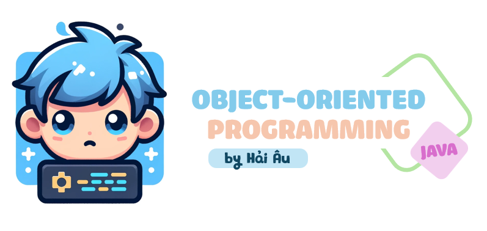

# Lập trình hướng đối tượng với Java

Chào mừng bạn đến với kho lưu trữ **Lập trình hướng đối tượng với Java**! Nơi đây cung cấp một nguồn tài nguyên toàn diện để khám phá và học hỏi lập trình hướng đối tượng qua ngôn ngữ Java.

> Lập trình hướng đối tượng (OOP - Object-Oriented Programming) là một mô hình lập trình phổ biến được sử dụng rộng rãi trong phát triển phần mềm. Nó được dựa trên các khái niệm về "đối tượng", là các thực thể kết hợp cả dữ liệu (thuộc tính) và các phương thức (hành vi). OOP tập trung vào việc thiết kế phần mềm dựa trên các đối tượng tương tác với nhau, thay vì quy trình và logic như trong lập trình hướng thủ tục.

 Các nguyên tắc cơ bản của lập trình hướng đối tượng

 

Lập trình hướng đối tượng dựa trên 4 nguyên tắc cơ bản, đó là: Đóng gói, Kế thừa, Đa hình, và Trừu tượng hóa. Mỗi nguyên tắc này cung cấp một cách tiếp cận để giải quyết các vấn đề trong phát triển phần mềm và giúp quản lý mã nguồn một cách hiệu quả hơn.

- **Đóng gói** (Encapsulation): Đây là khái niệm che giấu chi tiết triển khai bên trong của đối tượng, ngăn người dùng trực tiếp truy cập vào dữ liệu bên trong. Đóng gói giúp bảo vệ dữ liệu và hành vi của đối tượng khỏi sự can thiệp không mong muốn và cung cấp một giao diện thống nhất để tương tác với đối tượng.

- **Kế thừa** (Inheritance): Kế thừa cho phép một lớp mới kế thừa các thuộc tính và phương thức từ một lớp đã có sẵn. Lớp mới này có thể bổ sung thêm hoặc sửa đổi các thành phần thừa kế để đáp ứng nhu cầu riêng của nó, giúp tái sử dụng và mở rộng mã nguồn một cách hiệu quả.

- **Đa hình** (Polymorphism): Đa hình là khả năng mà theo đó các lớp khác nhau có thể được sử dụng thông qua cùng một giao diện. Phương thức có thể được định nghĩa trong một lớp cơ sở và được thay thế bởi các phương thức có cùng tên trong các lớp dẫn xuất, cho phép các đối tượng được xử lý thông qua giao diện chung mà không cần biết kiểu dữ liệu cụ thể của chúng.

- **Trừu tượng hóa** (Abstraction): Trừu tượng hóa cho phép lập trình viên tập trung vào những gì một đối tượng làm mà không cần quan tâm đến cách thực hiện. Nó tạo ra một lớp cơ sở mô tả một giao diện tổng quát mà các lớp dẫn xuất sẽ thực thi, đơn giản hóa việc quản lý sự phức tạp của hệ thống.

Ưu điểm của lập trình hướng đối tượng

 

Lập trình hướng đối tượng mang lại nhiều ưu điểm vượt trội trong phát triển phần mềm, giúp nó trở thành một trong những mô hình thiết kế và lập trình chính trong ngành công nghệ thông tin. Dưới đây là những ưu điểm của nó:

- **Tái sử dụng mã**: OOP cho phép lập trình viên sử dụng lại mã nguồn thông qua cơ chế kế thừa. Lớp con có thể kế thừa tính năng từ lớp cha mà không cần phải viết lại mã đó. Điều này giúp giảm bớt lượng công việc lập trình, giảm thiểu các lỗi tiềm ẩn và tăng tốc độ phát triển phần mềm.

- **Dễ dàng bảo trì và sửa lỗi**: Cấu trúc đóng gói trong OOP giúp che giấu chi tiết triển khai, chỉ cung cấp giao diện (interface) cần thiết cho người dùng. Điều này làm cho việc bảo trì và cập nhật hệ thống trở nên dễ dàng hơn, vì thay đổi bên trong một đối tượng không ảnh hưởng tới các đối tượng khác.

- **Mô hình hóa thực tiễn**: OOP cho phép lập trình viên mô hình hóa các thực thể thực tế dưới dạng đối tượng phần mềm, làm cho mã nguồn dễ hiểu và quản lý hơn. Việc sử dụng các đối tượng như là biểu diễn của dữ liệu và hành vi trong thế giới thực giúp phát triển phần mềm trở nên trực quan và gần gũi hơn với người lập trình.

- **Tính mở rộng**: Nhờ vào khả năng kế thừa và đóng gói, OOP dễ dàng mở rộng. Một lớp mới có thể được tạo ra với sự kế thừa từ một hoặc nhiều lớp đã tồn tại mà không làm ảnh hưởng tới những lớp đó. Điều này giúp hệ thống phát triển một cách linh hoạt và thích ứng với nhu cầu mới một cách nhanh chóng.

- **Tính bảo mật**: Đóng gói không chỉ giúp ẩn đi chi tiết triển khai mà còn cung cấp một lớp bảo mật. Dữ liệu bên trong một đối tượng được bảo vệ khỏi sự truy cập trực tiếp từ bên ngoài, đảm bảo tính toàn vẹn và an toàn của dữ liệu.

Lý do bắt đầu học lập trình hướng đối tượng bằng Java

 

Java là một trong những ngôn ngữ lập trình phổ biến nhất được sử dụng để giảng dạy lập trình hướng đối tượng vì nhiều lý do chính đáng.

- **Java là một ngôn ngữ thuần túy hướng đối tượng**, nghĩa là mọi thứ trong Java đều là đối tượng hoặc lớp. Các khái niệm như kế thừa, đóng gói, đa hình, và trừu tượng hoàn toàn được tích hợp sẵn trong ngôn ngữ. Điều này giúp người học dễ dàng tiếp cận và thực hành các nguyên lý OOP một cách tự nhiên trong quá trình lập trình.

- **Java có cú pháp khá rõ ràng và dễ hiểu.** Cú pháp của Java dựa trên C/C++, nhưng đã loại bỏ một số tính năng phức tạp như con trỏ trực tiếp, làm cho nó trở thành ngôn ngữ lý tưởng để giảng dạy cho người mới bắt đầu. Việc loại bỏ những tính năng phức tạp này giúp người học tập trung vào việc hiểu các khái niệm cốt lõi của OOP mà không bị sa lầy vào các chi tiết khó hiểu.

- **Java là ngôn ngữ độc lập nền tảng**, có thể chạy trên bất kỳ hệ điều hành nào có máy ảo Java (JVM). Điều này có nghĩa là các chương trình Java có thể phát triển và thực thi một cách nhất quán trên các nền tảng khác nhau mà không cần thay đổi mã. Sự linh hoạt này là lý tưởng cho môi trường học tập, nơi sinh viên và giáo viên có thể sử dụng nhiều loại phần cứng và phần mềm.

## Mục lục

Trong khi sử dụng kho lưu trữ này cho việc học tập, bạn nên tuân theo nguyên tắc sắp xếp được đề cập sau đây. Hãy đọc các mục theo đúng quy tắc từ trên xuống dưới, những phần đầu tiên sẽ là cơ sở của những nội dung tiếp theo. Riêng phần *Phụ lục* bạn có thể tham khảo bất cứ lúc nào, nó chứa một số cuốn sách tôi sử dụng cho việc thiết kế nên kho lưu trữ này. 

Phần 1: Giới thiệu

- [**Bắt đầu với Java**](#bắt-đầu-với-java)
  - Máy ảo Java
  - So sánh Java với một số ngôn ngữ lập trình khác: tính di động, tốc độ và an toàn
  - Quản lý động bộ nhớ
  - Khả năng phát hiện và xử lý lỗi
- [**Introduction**](1.%20Introduction/)
  - [HelloWorld](1.%20Introduction/HelloWorld.java)
  - [HelloJava](1.%20Introduction/HelloJava.java)
  - [DataTypes](1.%20Introduction/DataTypes.java)
  - [Wrappers](1.%20Introduction/Wrappers.java)
  - [Boxing](1.%20Introduction/Boxing.java)
  - [Arrays](1.%20Introduction/Arrays.java)
  - [ArgumentPassing](1.%20Introduction/ArgumentPassing.java)
  - [MethodOverloading](1.%20Introduction/MethodOverloading.java)
  - [ObjectsInJava](1.%20Introduction/ObjectsInJava.java)
  - [ObjectCreation](1.%20Introduction/ObjectCreation.java)
  - [ObjectDestruction](1.%20Introduction/ObjectDestruction.java)
  - [ThisReference](1.%20Introduction/ThisReference.java)

Phần 2: Nguyên lý lập trình hướng đối tượng

- [**Object-oriented Programming Principles**](2.%20Object-oriented%20Programming%20Principles/)
  - [Subclass](2.%20Object-oriented%20Programming%20Principles/Subclass.java)
  - [Casting](2.%20Object-oriented%20Programming%20Principles/Casting.java)
  - [SuperConstructor](2.%20Object-oriented%20Programming%20Principles/SuperConstructor.java)
  - [Abstract](2.%20Object-oriented%20Programming%20Principles/Abstract.java)
  - [Interface](2.%20Object-oriented%20Programming%20Principles/Interface.java)

Phần 3: Cấu trúc dữ liệu và thuật toán

- [**Data Structures and Algorithms**](3.%20Data%20Structures%20and%20Algorithms/)

Phần 4: Các dự án của tôi

- [**TicTacToe**](4.%20My%20Projects/TicTacToe.java)

Phụ lục

- [**Tài liệu tham khảo**](#tài-liệu-tham-khảo)
- [**Tải xuống tài liệu tham khảo**](documents)

## Bắt đầu với Java

1. Máy ảo Java (JVM)

 

Java vừa là ngôn ngữ lập trình vừa được **biên dịch** (complied) vừa được **thông dịch** (interpreted). Trong Java, mã nguồn được biên dịch thành bytecode, đó là các chỉ thị nhị phân đơn giản hoạt động như mã máy cho máy tính. Tuy nhiên, khác với C hay C++, bytecode của Java không phải là mã máy bản địa cho bất kỳ loại vi xử lý cụ thể nào mà là cho một máy ảo Java (JVM), một nền tảng chung cho mọi hệ thống.

Bytecode này sau đó được máy ảo Java thông dịch và thực thi như thể nó là mã máy bản địa. JVM hoạt động giống như một hệ điều hành thực sự trong việc quản lý bộ nhớ và xử lý các lệnh, đảm bảo an toàn và di động của mã. Mọi đặc điểm của ngôn ngữ Java đều được định nghĩa rõ ràng, không phụ thuộc vào hệ thống nền tảng cụ thể nào, giúp Java có khả năng chạy đồng nhất trên nhiều nền tảng khác nhau mà không cần chỉnh sửa mã.

JVM cung cấp một môi trường thực thi an toàn, nơi nó thực hiện các chức năng tương tự như một hệ điều hành. Nó quản lý bộ nhớ, thực thi các lệnh dựa trên ngăn xếp, và xử lý các kiểu dữ liệu nguyên thủy. Việc này giảm thiểu các rủi ro bảo mật và tăng tính ổn định của ứng dụng.

2. So sánh Java với một số ngôn ngữ lập trình khác: tính di động, tốc độ và an toàn

 

Dù có vẻ ngoài tương tự như C và C++ về cú pháp, Java không phải là hậu duệ trực tiếp của C hay là phiên bản tiếp theo của C++. Java có nhiều điểm chung với các ngôn ngữ động như Smalltalk và Lisp hơn là với C. Sự giống nhau chỉ dừng lại ở cú pháp bên ngoài như sử dụng nhiều dấu ngoặc nhọn và dấu chấm phẩy. Java thừa hưởng triết lý của C về một ngôn ngữ tốt nên gọn nhẹ, dễ nhớ nhưng lại mở rộng vốn từ vựng qua các gói lớp Java.

Ngôn ngữ kịch bản như Perl, Python và Ruby rất phổ biến vì chúng phù hợp cho các ứng dụng an toàn, được kết nối mạng. Tuy nhiên, hầu hết các ngôn ngữ kịch bản không được thiết kế cho lập trình quy mô lớn nghiêm túc. Chúng thường không phù hợp cho các dự án lớn hay phức tạp vì cấu trúc chương trình lỏng lẻo và hệ thống kiểu dữ liệu đơn giản.

Java cung cấp một nền tảng an toàn để phát triển các framework cấp cao hơn và thậm chí là các ngôn ngữ khác, kết hợp sự đơn giản và tính năng của Java cho phép phát triển nhanh chóng và dễ dàng thay đổi ứng dụng. Java cũng đã học hỏi từ các tính năng của Smalltalk và cải tiến chúng, đặc biệt là trong việc sử dụng bộ kiểm tra bytecode để đảm bảo tính chính xác của mã Java biên dịch, giúp nâng cao hiệu suất và đảm bảo an toàn hơn so với Smalltalk.

Java được thiết kế để là một ngôn ngữ an toàn, không chỉ chống lại các lỗi phần mềm mà còn các vấn đề thường gặp trong thiết kế và lập trình. Java cung cấp nhiều lớp bảo vệ, từ kiểm tra an toàn của mã trước khi chạy cho đến cách thức mà trình tải lớp (class loader), một cơ chế tải bytecode của trình thông dịch Java, tạo ra một "bức tường" xung quanh các lớp không đáng tin cậy. Những tính năng này là nền tảng cho các chính sách bảo mật cấp cao, cho phép hoặc không cho phép các loại hoạt động khác nhau trên từng ứng dụng.

Java bắt đầu từ một "tấm bảng trắng" và do đó có thể tránh được những tính năng phức tạp hoặc gây tranh cãi có trong các ngôn ngữ khác. Ví dụ, Java không cho phép lập trình viên tái định nghĩa các toán tử (như + hay -), không có tiền xử lý mã nguồn như macros hay #define statements, những thứ thường được dùng trong các ngôn ngữ khác để hỗ trợ sự phụ thuộc vào nền tảng.

Java cũng cung cấp một cấu trúc gói (package) rõ ràng để tổ chức các tệp lớp, giúp trình biên dịch xử lý một số chức năng của công cụ make truyền thống một cách hiệu quả. Mọi thông tin kiểu dữ liệu đều được bảo toàn trong các lớp Java đã biên dịch, không cần tới các tệp tiêu đề nguồn thừa như trong C/C++. Điều này khiến mã Java dễ đọc và ít cần đến ngữ cảnh hơn.

Java chỉ hỗ trợ kế thừa đơn (mỗi lớp chỉ có một lớp "cha" duy nhất) nhưng cho phép kế thừa nhiều giao diện (interface). Giao diện trong Java, tương tự như lớp trừu tượng trong C++, xác định hành vi của một đối tượng mà không định nghĩa thực thi của nó. Đây là một cơ chế mạnh mẽ cho phép nhà phát triển định nghĩa một "hợp đồng" về hành vi của đối tượng mà có thể được sử dụng và tham chiếu một cách độc lập với bất kỳ thực thi đối tượng cụ thể nào.

3. Quản lý động bộ nhớ

 

Java loại bỏ việc sử dụng con trỏ có thể tham chiếu tới bất kỳ khu vực bộ nhớ nào và thêm vào thu gom rác tự động cùng mảng cấp cao. Những tính năng này giúp loại bỏ nhiều vấn đề liên quan đến an toàn, khả năng chuyển đổi và tối ưu hóa mà các ngôn ngữ khác thường gặp phải. Trong Java, các đối tượng không còn được sử dụng sẽ tự động được thu hồi bộ nhớ, giảm thiểu lỗi do quản lý bộ nhớ thủ công.

Java không sử dụng con trỏ theo nghĩa truyền thống mà thay vào đó là các tham chiếu, định kiểu chặt chẽ và an toàn hơn. Các đối tượng trong Java, ngoại trừ các kiểu nguyên thủy, được truy cập qua tham chiếu. Điều này cho phép xây dựng các cấu trúc dữ liệu phức tạp một cách an toàn về kiểu dữ liệu mà không có rủi ro liên quan đến con trỏ trong C/C++.

4. Khả năng phát hiện và xử lý lỗi

 

Java được thiết kế để xử lý lỗi một cách thông minh và hiệu quả, nhờ vào cơ chế quản lý ngoại lệ mạnh mẽ. Trong Java, các lỗi không chỉ được bắt và xử lý tại một nơi cụ thể trong chương trình thông qua khối mã "catch", mà còn được đóng gói thành các đối tượng ngoại lệ. Mỗi đối tượng này mang thông tin về nguyên nhân gây ra lỗi, giúp lập trình viên dễ dàng hiểu và xử lý lỗi một cách chính xác. Trình biên dịch Java đòi hỏi phương thức phải tuyên bố các ngoại lệ mà nó có thể phát sinh, hoặc là phải tự xử lý chúng ngay lập tức. Điều này giúp đưa thông tin lỗi lên cùng mức độ quan trọng với các thông tin khác như kiểu dữ liệu trả về hay tham số của phương thức. Qua đó, khi lập trình, bạn có thể dự đoán và chuẩn bị sẵn sàng cho các tình huống có thể xảy ra, đảm bảo rằng ứng dụng của bạn sẽ hoạt động ổn định và an toàn hơn.

## Tài liệu tham khảo

- Patrick Niemeyer, Jonathan Knudsen; *Learning Java*; Third Edition.
- Marc Loy, Patrick Niemeyer, Jonathan Knudsen; *Learning Java: An Introduction to Real-World Programming with Java*; Fifth Edition.
